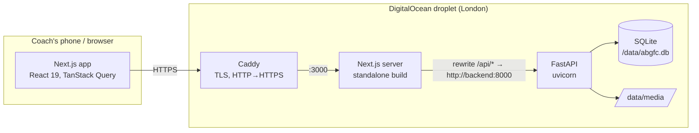
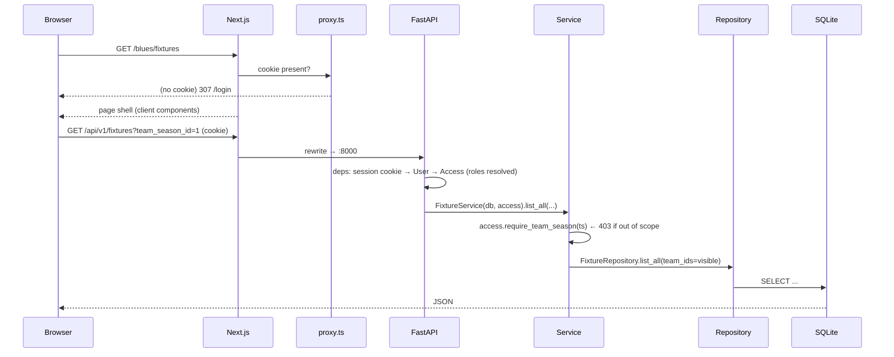

# 2. Architecture

## System view



Only Caddy has a public port. The browser never talks to the API directly: Next.js
rewrites `/api/*` to the API over the Docker network, so the session cookie is
first-party, there is no CORS in production, and the API — which holds children's
data — has no public endpoint at all. Locally it's the same shape without Caddy:
`next dev` on :3000 rewrites to uvicorn on :8000.

## Request flow



Two things to notice:

- **`proxy.ts` is a convenience, not security.** It only checks the cookie *exists*, to
  bounce logged-out users to `/login` quickly. Every real decision is made in the API.
- **Access is resolved once per request** (`Access.for_user`) and every service method
  asks it a question (`require_team_season`, `require_player`, `require_cohort`) before
  touching data. Repositories additionally take `team_ids`/`cohort_ids` filters for list
  queries so results are scoped, not just guarded.

## Backend layering

```
api/routers/*     thin: parse request → call one service method → return schema
services/*        business rules, access checks, transactions (commit here, nowhere else)
repositories/*    all SQLAlchemy queries; nothing else touches the session
models/*          ORM tables
schemas/*         Pydantic request/response models (the API contract)
core/             errors (→ HTTP status), security (argon2, signed cookie)
db/               engine (FK pragma), session dependency, declarative base
```

Rules that keep it clean:

- Routers never import models or run queries. If a router needs data it calls a service.
- Services own transactions: they `commit()`; repositories `flush()` at most.
- Repositories return ORM objects; services convert to schemas when the shape differs
  (e.g. `FixtureDetail` folds assist rows into their goals).
- Errors are raised as `AppError` subclasses (`NotFoundError` 404, `ConflictError` 409,
  `ValidationError` 422, `ForbiddenError` 403, `AuthError` 401) and one handler in
  `main.py` turns them into `{"detail": "..."}`.
- The stats engine (`services/stats.py`) is pure functions over already-loaded rows,
  with a thin `StatsService` that loads via repositories — so the arithmetic is unit-tested
  without a database.

## Frontend layering

```
app/                     routes (App Router); pages are client components using $api hooks
  (app)/layout.tsx       loads /auth/me → MeProvider; everything under here is authenticated
  (app)/[team]/layout.tsx  resolves the team slug against `me`, TeamProvider, AppShell + nav
components/features/*    feature components (dashboard, fixtures, players, settings, admin, cohort)
components/ui/*          shadcn/ui primitives (generated; edit freely, they're yours)
components/*             shell, switchers, empty/error states, avatar
lib/api/                 openapi.json → schema.d.ts (generated) → client.ts ($api, fetchClient)
lib/me-context.tsx       who am I, what can I reach, where do I land
lib/team-context.tsx     which team + team season am I looking at; sets the accent colour
proxy.ts                 cookie-presence redirect (Next 16's middleware)
```

Data fetching is client-side with TanStack Query through `openapi-react-query`, so every
call is typed against the backend's OpenAPI schema and cache keys are
`["get", "/api/v1/...", init]` — invalidating `["get", "/api/v1/fixtures"]` refreshes
every fixture query. This is also the seam for offline/optimistic writes later.

## Tech stack (pinned versions at time of writing)

| Layer | Choice | Version | Why |
|---|---|---|---|
| Language | Python | 3.13 | via `uv`, `.python-version` |
| API | FastAPI | 0.141 | typed routes, OpenAPI for free (drives the frontend client) |
| ORM / migrations | SQLAlchemy 2 / Alembic | 2.0.52 / 1.20 | mapped-column style, batch migrations for SQLite |
| Validation | Pydantic | 2.13 | `InputModel` (extra=forbid) / `ORMModel` (from_attributes) bases |
| Database | SQLite | bundled | one team's worth of data is tiny; one machine; simplest ops. FK enforcement on every connection. |
| Auth | argon2-cffi + itsdangerous | 25.1 / 2.2 | argon2id hashes; signed, timestamped session cookie |
| PDF | fpdf2 | 2.8 | pure Python, no system deps |
| Spreadsheet | openpyxl | 3.1 | writes formulas + formatting |
| Images | Pillow + pillow-heif | 12.3 / 1.7 | re-encode uploads, HEIC from iPhones |
| Web | Next.js (App Router) / React | 16.3 / 19.2 | Turbopack, `proxy.ts`, generated route types |
| Styling | Tailwind 4 + shadcn/ui (radix-nova) | 4.x / 4.21 | one accent token per team |
| Data | TanStack Query + openapi-fetch + openapi-react-query | 5.x / 0.17 / 0.5 | typed hooks from the schema |
| Runtime | Docker, Caddy 2, Ubuntu 24.04 | — | see [Deployment](09-deployment.md) |

Check `backend/uv.lock` and `frontend/package-lock.json` for exact versions.

## Key architectural decisions (ADR-style)

1. **Events, not columns.** Goals/assists are `match_events` rows; totals are counts. A
   goal is addressable, so a clip can attach to it later.
2. **Team-season is the unit of everything.** Not season, not team. Squads, fixtures,
   awards and stats hang off `team_seasons`. Rolling into a new season is a row.
3. **Explicit club teams, us-vs-opposition fixtures.** We are not a row in `teams`; a derby
   is two fixture rows (one per team), which matches how two coaching groups record it.
4. **Scoped roles resolved per request.** `user_roles` at club/cohort/team scope, widened
   upwards, enforced in services. The UI hides, the API decides.
5. **Stored scores + derived scorers.** At pitchside you know the score before the
   scorers; the app warns on mismatch instead of blocking.
6. **API never public in production.** Next proxies it; Caddy is the only listener.
7. **SQLite on a persistent volume, images built in CI.** Cheapest thing that is also
   simple; the 1GB droplet runs but does not build.
8. **Nothing is hard-deleted that carries history.** Players get `left_date`, squad rows
   `left_at`; fixtures cascade their children because they *are* the history.
