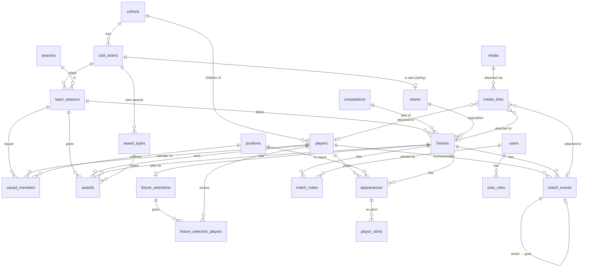

# 3. Data model

SQLite, managed by SQLAlchemy 2 models in `backend/app/models/` and Alembic migrations in
`backend/alembic/versions/`. The DDL in the latest migration is authoritative; this
document explains the shape and the reasoning.

## Entity relationship diagram



## Conventions

- Integer autoincrement primary keys (`id`). SQLite **reuses** ids after the highest row
  is deleted — never use an id as a cache key for something replaceable (photos use a
  random token instead).
- `created_at` / `updated_at` (`TimestampMixin`) on every table that is edited by users;
  pure lookups and child rows (stints, media links, user roles) omit them.
- Enums are `String` columns with a `CHECK` constraint; the values live in
  `models/enums.py` as `StrEnum`s and Pydantic mirrors them. Adding a value is a
  migration (the CHECK changes) plus the enum.
- `PRAGMA foreign_keys=ON` is set on every connection (`db/session.py`). `ondelete` is
  explicit everywhere: `RESTRICT` protects history, `CASCADE` follows ownership,
  `SET NULL` for optional back-references.
- Deterministic constraint names via the naming convention in `db/base.py`, so Alembic
  batch operations can find them.
- Booleans use `server_default="1"/"0"` — valid on SQLite. Moving to Postgres would need
  `true/false` (see [Roadmap](12-roadmap.md)).

## Tables

### Club structure

**`cohorts`** — an age group as a set of children, independent of season.
`name` (unique, "Born 2016/17"), `birth_year_start` (2016 = school year Sept 2016–Aug 2017),
`is_active`. `Cohort.age_group_for(season)` returns `"U10"` for a 2026/27 season.
Why: teams and the age-group coach's role need something that survives the yearly
U10 → U11 rename.

**`club_teams`** — our teams. `cohort_id`, `name` (unique within cohort), `slug` (unique,
used in URLs: `/blues`), `colour` (CSS oklch string, becomes the UI accent), `sort_order`,
`is_active`. Not to be confused with `teams`.

**`seasons`** — club-wide. `name` (unique, "2026/27"), `start_date`, `end_date`. Nothing
hangs off a season directly; it exists so every team's "2026/27" is the same season.

**`team_seasons`** — a club team in a season. `club_team_id`, `season_id` (unique
together), `age_group` ("U10", stored for display, derived at creation), `format` ("7v7"),
`match_minutes` (default 50; the FA U10 maximum — feeds time-on-pitch), `is_current`
(one per club team, enforced in `TeamSeasonService`), `arrival_lead_minutes` (default 30:
"Please arrive at" in the parents' message is kick-off minus this). **Squads, fixtures, awards and stats
all key on this.** Created by `TeamSeasonService.start`, which can copy the previous
squad forward.

### People

**`players`** — a child. `cohort_id`, `first_name`, `last_name` (nullable — the sheet only
had first names), `display_name` (unique within cohort in practice; enforced by the
service), `date_of_birth`, `joined_date`, `left_date` (soft leave), `notes`. Never
hard-deleted: appearances and events reference the player, so history survives a player
leaving or moving teams. `photo_key` is a Python property derived from the profile-photo
media link.

**`squad_members`** — player ↔ team season. `team_season_id`, `player_id` (unique
together), `squad_number` (partial unique per team season where not null),
`primary_position_id`, `joined_at`, `left_at`. A mid-season move between teams sets
`left_at` here and inserts a row on the destination (`POST /players/{id}/move`).

**`positions`** — lookup. `code` (GK/DEF/MID/FWD), `name`, `category` (same four values),
`sort_order`. Finer positions later are rows sharing a category.

**`users`** — logins. `username` (unique), `display_name`, `password_hash` (argon2id),
`is_active`. No `role` column — roles are rows below.

**`user_roles`** — `user_id`, `role` (`viewer` < `coach` < `admin`), `scope_type`
(`club` | `cohort` | `team`), `scope_id` (NULL for club, else cohort or club_team id).
Unique per (user, scope_type, scope_id). CHECK: club rows have NULL scope_id, others
don't. Resolved per request into `services/access.py::Access`.

### Competition

**`competitions`** — global lookup. `name` (unique), `type` (`league` | `cup` |
`friendly` | `tournament`), `is_active`. League-only stats filter on `type`, so a second
league competition ("Conference League" and "Zidane League" both exist) needs no code.

**`teams`** — opposition. `name` (unique), `short_name`, `colours`, `notes`,
`club_team_id` (nullable: set when the opposition is one of our own teams, i.e. a derby).
We are never "the home team" in a row; fixtures are always us-vs-opposition.

**`fixtures`** — `team_season_id`, `competition_id`, `opposition_team_id`,
`match_number` (unique per team season, auto-assigned as max+1 if omitted), `kickoff_at`,
`venue` (`home` | `away` | `neutral`), `venue_notes` (ground), `status` (`scheduled` |
`live` | `played` | `postponed` | `cancelled` | `abandoned` — `live` is a match being
recorded from the pitch, see [Features](11-features.md#live-match-entry)), `our_score`,
`their_score` (NULL until played or live; CHECK ≥ 0), `duration_minutes` (overrides the team season's default),
`notes` (one-line admin). Index on (team_season_id, kickoff_at).
Scores are **stored** as well as derivable from events; `stats.score_warnings()` reports
disagreements instead of blocking entry.

### Match detail

**`appearances`** — one row per player per fixture (unique). `started`, `position_id`,
`shirt_number`, `captain`. Cascade-deleted with the fixture. This is what the result
entry screen writes; positions are accepted by the API but the UI sends `null` today.

**`player_stints`** — rolling-sub detail, **designed and computed but not yet written by
the UI**. `appearance_id` (so a stint can't exist for someone who didn't play),
`on_minute`, `off_minute` (NULL = until the final whistle), `position_id`. CHECK
`off > on`. `stats.minutes_for_appearance()` sums them, clipped to the match length.

**`match_events`** — `fixture_id`, `player_id` (NULL only for `opp_own_goal`, enforced by
CHECK), `event_type` (`goal` | `assist` | `own_goal` | `opp_own_goal`), `minute`,
`sequence` (ordering when minutes are unknown), `related_event_id` (self-FK: **an assist
points at its goal**), `notes`. Goals and assists are `COUNT(*)`s. A goal is therefore an
addressable row a clip can attach to. `own_goal` counts against us and appears on the
player's record; `opp_own_goal` counts for us with no player.

**`match_notes`** — free text on a fixture, typically a WhatsApp report. `body`,
`author` (who wrote the message), `sent_at` (when), `created_by_user_id` (the coach who
pasted it). Several per fixture; cascade with the fixture.

### Pre-match availability

**`fixture_selections`** — who can play in an upcoming fixture, one per fixture
(`fixture_id` unique, cascades). `coaching` ("Adam & Dan"), `notes` (free text for
parents), `created_by_user_id`. A plan, not a record: `appearances` (who played) are
only ever written by the result flows, and the stats engine never reads this table.

**`fixture_selection_players`** — one row per player asked: `selection_id` (cascade),
`player_id` (RESTRICT), `status` (`available` | `unavailable`), `reason` ("injured").
Unique per (selection, player). The available players are the squad the parents'
message lists and the default line-up for result entry and the live screen. A player
must be in the team's cohort (which includes its squad). Replaced whole on every `PUT` —
a header row with children rather than JSON so player ids are FK-enforced and "how often
has X been unavailable" is a query later.

### Awards

**`award_types`** — `code` (unique), `name`, `scope` (`match` | `month` | `season`),
`sort_order`, `is_active`, `club_team_id` (NULL = club-wide, else only that team sees it).
Seeded: `coaches_potm`, `parents_potm`. A team's own award ("Blues most improved") is a
row with `club_team_id` set; its code is `<slug>_<name>`.

**`awards`** — `award_type_id`, `team_season_id`, `player_id`, `fixture_id` (nullable for
month/season awards), `period_label` ("September"), `notes`. Unique on (type, fixture,
player) — so **joint winners are allowed**. Cascade with the fixture.

### Media

**`media`** — `kind` (`youtube` | `photo` | `file`), `url` (YouTube) or `storage_key`
(path under the media dir, no extension), `title`, `description`, `captured_at`,
`content_type`, `size_bytes`. CHECK: youtube rows have a url, others a storage_key.

**`media_links`** — `media_id` plus **three nullable FKs** `fixture_id`, `player_id`,
`match_event_id` with a CHECK that exactly one is set, `role` (e.g. `profile_photo`,
later `full_match`, `highlights`, `goal_clip`), `sort_order`. Real FKs with cascades,
unlike a `target_type/target_id` pair. In use: a player's profile photo is a `photo`
media row + a link with `role='profile_photo'`.

## Migrations

```
20260912_2217_initial_schema.py   the original single-team schema
20260912_2346_multi_team.py       cohorts, club teams, team seasons, user roles; remaps
                                  existing rows into a Blues team season; users → club admin
20260915_2143_match_notes.py      match_notes
20260920_1127_live_fixture_status.py  adds 'live' to the fixtures.status CHECK
20260920_1233_squad_selection.py  fixture_selections, fixture_selection_players,
                                  team_seasons.arrival_lead_minutes
```

- Alembic runs in **batch mode** (`render_as_batch=True`) because SQLite can't `ALTER`
  most things; each altered table is rebuilt.
- `alembic/env.py` deliberately opens the connection **without** the FK pragma: batch
  rebuilds drop and recreate tables, which SQLite refuses with foreign keys on. The app
  itself always has them on.
- Workflow: change the model → `make migration m="describe it"` → read the generated file
  (autogenerate misses data moves, CHECK changes on SQLite, and partial indexes need
  `sqlite_where=sa.text(...)`) → `make migrate` → `uv run alembic check` must report no
  drift → run `alembic downgrade -1 && upgrade head` once to prove the round trip.
- Migrations run automatically in production at container start (`scripts/seed.py`
  calls `alembic upgrade head` before the idempotent seed).

## Seed data (`services/bootstrap.py`)

- `seed_reference_data` — positions, competitions (League/Cup/Friendly/Tournament), the
  two club-wide award types. Idempotent.
- `seed_user` — the club admin (`ABGFC_COACH_USERNAME`/`PASSWORD`); re-running updates the
  password.
- `seed_club_structure` — the "Born 2016/17" cohort, Blues/Blacks/Reds/Whites with
  colours, the 2026/27 season, a current team season per team. Idempotent.
- `seed_real_season` — the actual Blues 2026/27 data (match 1 v Manor Colts, the league
  fixture list, Conference/Zidane League competitions). Used by `make seed` and production.
- `seed_demo_season` — a fictional six-match season with **hand-checked totals in its
  docstring**; the oracle for `tests/test_stats.py`. Used by `make seed-demo` and tests.
