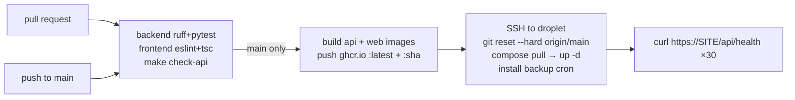

# 9. Deployment and operations

## Topology

One DigitalOcean droplet, `abgfc`, in London (`lon1`): `s-1vcpu-1gb`, Ubuntu 24.04,
$6/month, no paid backup add-on. Public IP `167.172.49.19`; DNS `abgfc.neuralaspect.com`
(A record at IONOS) → the droplet.

```
Internet ──443/80──▶ caddy ──▶ frontend:3000 (Next standalone) ──/api/*──▶ backend:8000 (uvicorn)
                                                                              │
                                                              /data/abgfc.db, /data/media, /data/backups
```

`docker-compose.prod.yml` defines the three services. Only `caddy` publishes ports. Images
come from GHCR; the box never builds (1GB is enough to run, not to `next build`).

## Provisioning (done once; repeatable)

`deploy/cloud-init.yaml` — substituted with your public key by `make droplet`:

- `deploy` user, sudo, key-only SSH; `PasswordAuthentication no`, `PermitRootLogin no`
- `ufw`: deny incoming, allow OpenSSH/80/443
- `unattended-upgrades` (security), automatic reboot 04:30 if required
- `fail2ban` on sshd
- Docker CE + compose plugin from Docker's repo
- 2GB swap file, `vm.swappiness=10`
- `git clone` of the repo to `/opt/abgfc`; `/data/{media,backups}` owned by `deploy`
- touches `/var/lib/cloud/abgfc-ready` when finished

```bash
doctl auth init                                   # once, with a DO personal access token
doctl compute ssh-key create abgfc-deploy --public-key "$(cat ~/.ssh/abgfc_deploy.pub)"
SSH_KEY_ID=<id> make droplet                       # creates the droplet, prints the IP
# then on the box: write /opt/abgfc/.env (see .env.production.example), chmod 600
make deploy
```

The Mac-side SSH key is `~/.ssh/abgfc_deploy` (ed25519, no passphrase, in the keychain);
`~/.ssh/config` maps the droplet IP to it. `.env.production` (gitignored) holds
`DEPLOY_HOST=deploy@<ip>`, `SITE_ADDRESS`, and the initial admin password.

## Configuration on the box: `/opt/abgfc/.env`

```
SITE_ADDRESS=abgfc.neuralaspect.com       # Caddy site; must resolve to the droplet
LEGACY_ADDRESS=167.172.49.19.sslip.io     # old hostname, 301 → SITE_ADDRESS (optional)
ABGFC_SECRET_KEY=<openssl rand -hex 32>
ABGFC_COACH_USERNAME=coach
ABGFC_COACH_PASSWORD=<initial admin password>
IMAGE_TAG=latest                          # or a commit SHA to pin/roll back
```

`docker-compose.prod.yml` maps these into the containers and sets `ABGFC_ENV=production`,
`ABGFC_DATABASE_URL=sqlite:////data/abgfc.db`, `ABGFC_MEDIA_DIR=/data/media`.

## CI/CD (`.github/workflows/ci.yml`)



- Branch protection on `main` requires the three checks for PRs; admins can push directly.
- Deploy is serialised (`concurrency: deploy`) and **pulls before swapping**, so a failed
  pull leaves the old containers running. A failed health check fails the run (the new
  version is up but unhealthy — investigate with `make prod-logs`).
- Repository secrets: `DEPLOY_SSH_KEY` (private key whose public half is in the droplet's
  `authorized_keys`), `DEPLOY_HOST`, `DEPLOY_KNOWN_HOSTS` (`ssh-keyscan` output),
  `SITE_ADDRESS`.
- Images are public (the repo is public), tagged `latest` and the commit SHA.

## Routine operations

| Task | Command |
|---|---|
| Deploy current `main` by hand | `make deploy` |
| Tail logs | `make prod-logs` |
| Shell | `make prod-shell` (then `cd /opt/abgfc; docker compose -f docker-compose.prod.yml …`) |
| Backup now → local copy | `make backup` (→ `data/backups/abgfc-<stamp>.db`) |
| Restore | `make restore FILE=data/backups/abgfc-….db` (5 s to abort; keeps `pre-restore-…` on the box) |
| Roll back code | set `IMAGE_TAG=<sha>` in `/opt/abgfc/.env`, `make deploy`; revert with `latest` |
| Rotate the secret key | change `ABGFC_SECRET_KEY`, `make deploy` — every session is signed out |
| Reset the admin password | change `ABGFC_COACH_PASSWORD`, `make deploy` (seed re-hashes on start) — or use `/admin` |
| Add a coach | `/admin` → Add coach (team or cohort scope) |

## Backups

Three layers, the first two free and in place:

1. **Nightly on the box**: `deploy/backup.sh` via the deploy user's crontab (installed by
   every deploy) at 02:00 — `sqlite3 .backup` (consistent while running), integrity
   check, 14-day retention in `/data/backups`, log at `/data/backups/backup.log`.
   The API container runs as root and owns `/data/abgfc.db` (mode 600; `restore.sh`
   sets it that way too), so the script reads it with `sudo -n` — the deploy user has
   passwordless sudo from cloud-init. **Check `backup.log` after every deploy**: from
   15 to 20 September 2026 it read "unable to open database" nightly because the
   script lacked the sudo, and nobody noticed for a week.
2. **Off-box**: `make backup` takes a fresh copy and pulls it to your Mac. Do this
   regularly; it's the only copy that survives losing the droplet.
3. **DigitalOcean droplet backups** — enabled 20 September 2026: weekly, Sundays
   04:00–08:00 UTC (after Saturday's results are in), 28-day retention, $1.20/month.
   Whole-disk, so it covers `/data/media` too. Restoring one replaces the entire droplet
   (`doctl compute droplet-action restore <id> --image-id <backup>`), so it's the
   "lost the box" layer, not the "a coach deleted a fixture" layer — use the SQLite
   copies for that. Policy: `doctl compute droplet backup-policies get 600477835`;
   the plan defaults to *daily* ($1.80) if re-enabled, so set weekly explicitly with
   `droplet-action change-backup-policy`.

**Photos are not in the SQLite backup.** `/data/media` needs its own copy — see the
roadmap; until then `rsync -a deploy@<ip>:/data/media data/media-backup/` by hand.

Restore was rehearsed in production (delete a fixture → restore → back). The live
database file is root-owned (the container runs as root), which is why `restore.sh`
uses `sudo` for the swap.

## Runbooks

**Site down** — `curl -I https://abgfc.neuralaspect.com`; if Caddy answers but 502,
`make prod-logs`; if nothing answers, `doctl compute droplet list` / DO console, then
`make prod-shell` and `docker compose -f docker-compose.prod.yml ps`. Containers have
`restart: unless-stopped`; a reboot brings them back (tested).

**Certificate problems** — Caddy renews automatically; check `docker compose logs caddy`.
DNS must still point at the droplet and ports 80/443 must be reachable (ACME uses both).

**Disk** — 25GB; SQLite is hundreds of KB, photos ~20KB each. `docker image prune -f` runs
on every deploy. Check `df -h /` and `/data/backups` retention if it ever fills.

**Changing the droplet IP** — update the A record, `DEPLOY_HOST`/`DEPLOY_KNOWN_HOSTS`
secrets, `.env.production`, `~/.ssh/config`, and `LEGACY_ADDRESS` if still used.

**Someone leaves** — `/admin` → toggle the user inactive (immediate: checked per request).
